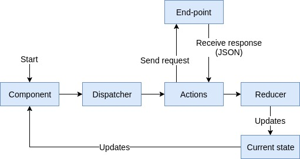

# README

**HELP WANTED**

- Documentation
	- [x] Describe the source achitecture
	- [x] Describe how requests are sent to back-end
	- [ ] Describe how JSON response is used
	- [x] Describe how testing is done

## The Source Directory Structure

The `src` directory contains the main font-end code base (`public` contains just a simple HTML file used by React
to inject HTML dynamically).

Here is an overview of the directory tree with a brief description of what each file and folder represents.

- `farandula/demos/client/src/`
    - `actions/`
        Contains *action types* and *action creators*
        - `__tests__/` Contains tests for *action types* and *action creators*
    - `api/` Contains files to connect with the *api*
    - `components/` Contains *presentational components* lacking state
        - `Avail/` Contains *avail components*
          - `__tests__/` Contains tests for *avail components*
        - `Booking/` Contains *booking components*
          - `__tests__/` Contains tests for *booking components*
        - `Common/` Contains *common components*
          - `__tests__/` Contains tests for *common components*
        - `demos/` Contains *demos components*
          - `__tests__/` Contains tests for *demos components*
    - `containers/` Contains *container components* which connect *presentational components* with the *store*
    - `data/` Contains concrete data like *options*, *initial configs*, common/extrema inputs, etc
    - `reducers/` Contains *reducers* that map the current *state* and an *action* to a new *state*
    - `util/` Contains utility functions
    - `App.js` Sets up the *routes* with the *store* as a react *component*
    - `index.js` Defines the entry point for react, injecting the `App` component in the page
    - `router.js` Defines the *routes* to guide the movement between page components
    - `store.js` Sets up the *store* with the combined reducers and an initial state

## Requests to back-end

Here we can look a diagram showing how requests are made and what happens when we receive the response data.


---
<p align="center"></p>
---

The requests start in the component calling the action through the dispatcher. The action sends the request to the endpoint and receive a JSON. This JSON contains the back-end's response. Finally the action sends this JSON to the reducer where it is integrated to the current state and this updates the components that uses this data.

## JSON from response


## Tests

At this project we used this test: 

### Snapshot testing 

It is a form to test our UI component without writing certain test cases. Here's how it works: A snapshot is a individual state of our UI, saved in a file. We have a set of snapshots for our UI components. Once we add a new UI feature, we can generate new snapshots for the updated UI components.

### Testing action creators

Basically are functions which return plain objects. When testing action creators we want to test whether the appropriate action creator was called and also whether the right action was returned.

We can test our Front-end execute the command 

```
npm test
```